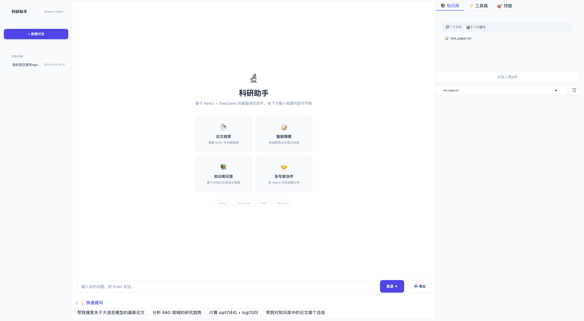
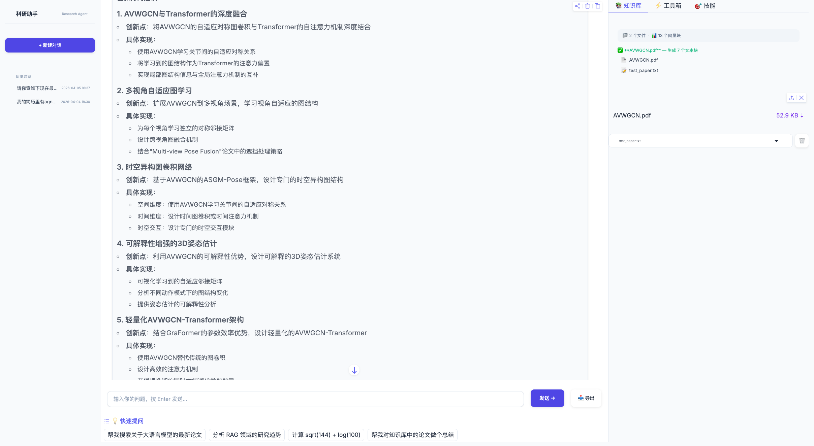

# 科研助手 Agent

> 基于 **LangGraph + RAG + Multi-Agent** 的端到端科研助手，集成论文检索、知识库问答、多专家协作、自我反思和长期记忆，工具层接入 **MCP（Model Context Protocol）**，提供流式可视化的推理过程。

[Python](https://www.python.org/)
[LangGraph](https://langchain-ai.github.io/langgraph/)
[MCP](https://modelcontextprotocol.io/)
[Gradio](https://gradio.app/)
[DeepSeek](https://platform.deepseek.com/)
[ChromaDB](https://www.trychroma.com/)
[License](#license)

---

## 项目亮点

- **LangGraph ReAct 图** — `agent → tools → agent` 推理-行动循环编排为状态图，推理步骤通过 `run_iter` 以结构化事件流式吐出，UI 端实时渲染（步数封顶，优雅收尾）
- **自我反思（Reflexion）** — Agent 与 Orchestrator 各内置 `reflect` 节点 + 条件回边，答案不达标自动带批评重做
- **MCP 协议** — 对外用官方 SDK 把工具暴露为 MCP Server（可被 Cursor / Claude Desktop 调用），对内作为 MCP Client 消费外部 MCP Server，工具透明融入 Agent
- **Pydantic 结构化契约** — 规划 / 事件 / 工具规范统一为 Pydantic 模型，边界即校验，解析健壮兜底
- **进阶 RAG 流水线** — 查询改写 → 多召回 → Cross‑Encoder（`BAAI/bge-reranker-base`）重排序 + 基于句子嵌入相似度的语义分块
- **Multi‑Agent 协作** — Planner LLM 拆分子任务并构建依赖图，4 个专家 Agent（文献 / 数据 / 写作 / 审查）持有各自领域的工具子集，按依赖顺序自主推理-调用工具，最终由总编节点融合 + 反思
- **三层记忆系统** — 短期摘要压缩 + 长期 SQLite 持久化（用户偏好 / 研究发现）+ 多会话 ChatHistory
- **Skills 系统（含执行引擎）** — 把常见科研工作流固化为可复用模板，可被真正"执行"驱动工具完成任务，并统计调用次数与成功率
- **流式可视化 UI** — Gradio + 自定义 CSS，支持知识库管理、历史会话切换、对话导出
- **自动化测试** — `pytest` 离线测试套件覆盖事件契约、解析兜底、图路径、反思、步数封顶、Skill 执行、MCP 往返

---


## 界面预览





界面三栏布局：

- **左侧**：品牌栏 / 新建对话 / 历史会话列表（支持加载、删除）
- **中间**：聊天区，流式展示「步骤 → 思考 → 工具调用 → 返回结果」全过程
- **右侧**：知识库管理 / 工具箱（按分类折叠展开）/ 技能列表

---


## 架构

```
┌───────────────────────────┐      ┌───────────────────────────────┐
│   Gradio Web UI (app.py)  │      │   FastAPI (api/) · SSE 流式    │
│ 推理轨迹 · 知识库 · 历史  │      │ /chat/stream · /sessions · … │
└─────────────┬─────────────┘      └───────────────┬───────────────┘
              └──────────────┬────────────────────┘
                             │ 两个客户端共用同一服务层
              ┌──────────────▼─────────────────────────┐
              │       服务层 (services/)               │
              │  会话隔离 · 并发保护 · 历史回灌        │
              └──────────────┬─────────────────────────┘
                             │ run_iter 事件流
              ┌──────────────▼─────────────────────────┐
              │        ReAct Agent (LangGraph)         │
              │  START→prepare→agent→[tools?]→tools→agent│
              │              └→reflect→[修订?]→agent    │
              │                   └→finalize→END        │
              └──────┬─────────────────┬───────────────┘
                     │                 │
        ┌────────────▼─────┐    ┌──────▼─────────┐
        │   MCP 工具层      │    │ Memory Manager │
        │ 注册表/绑定/分类  │    │ (短期+长期记忆)│
        └──┬────────────┬──┘    └──────┬─────────┘
           │            │              │
   ┌───────▼──────┐ ┌───▼───────────┐  │
   │ 本地内置工具 │ │ 外部 MCP 工具 │  │   ┌──────────────────────────────┐
   │(arxiv/rag/…) │ │ via MCP Client│  │   │ Orchestrator (LangGraph)     │
   └──────┬───────┘ └───────────────┘  │   │ plan→execute→synthesize      │
          │                            │   │      →reflect→(synthesize/END)│
   ┌──────▼─────┐                      │   │  4 Experts: Lit/Data/Wri/Rev │
   │ ChromaDB   │                      │   └──────────────┬───────────────┘
   │ +Embed     │                      │                  │
   │ +Rerank    │                      └──────────────────┤
   └────────────┘                                         │
                                              ┌───────────▼────────┐
   对外：mcp_server/research_mcp_server.py     │  DeepSeek LLM API   │
   把内置工具暴露为 MCP Server (stdio)          │  (OpenAI 兼容,      │
   → 可被 Cursor / Claude Desktop 调用          │   timeout+retry)    │
                                              └────────────────────┘
```


### 目录结构

```text
.
├── app.py                  # Gradio Web UI 入口（渲染 + 事件接线）
├── services/               # 服务层：Gradio 与 FastAPI 共用的业务逻辑
│   ├── agent_service.py    # 会话管理 / 对话事件流 / 并发保护 / 历史回灌
│   └── kb_service.py       # 知识库：上传 / 列举 / 删除 / 统计
├── api/                    # FastAPI HTTP 服务
│   ├── main.py             # 应用工厂（CORS / lifespan / 路由挂载）
│   ├── routes/             # sessions / chat(SSE) / knowledge / meta
│   ├── streaming.py        # 同步生成器 → 异步迭代（单线程，保住 contextvars）
│   ├── sse.py              # Server-Sent Events 编码
│   └── schemas.py          # HTTP 请求 / 响应模型
├── config/settings.py      # 全局配置（API key / 路径 / 步数 / 反思 / LLM 超时重试 / MCP_SERVERS）
├── core/
│   ├── llm.py              # DeepSeek LLM 客户端（chat，含 timeout + 自动重试）
│   ├── schemas.py          # Pydantic 模型：Plan / ReAct 事件 / ToolSpec / Reflection
│   ├── react_agent.py      # LangGraph ReAct 图（prepare/agent/tools/reflect/finalize）+ ToolRegistry
│   ├── budget.py           # 跨嵌套 Agent 的 LLM 调用数 / 时限预算（contextvars）
│   ├── parallel.py         # 并行执行（快照 contextvars，保住 RunBudget）
│   ├── mcp.py              # 工具注册表 / 绑定 / 外部 MCP 工具加载
│   └── mcp_client.py       # MCP Client：连接外部 MCP Server（异步→同步桥接）
├── mcp_server/
│   └── research_mcp_server.py  # MCP Server：把内置工具对外暴露（stdio）
├── agents/
│   ├── base_agent.py       # ExpertAgent 基类（专家关闭反思）
│   ├── specialists.py      # 4 个专家 Agent（含 ReviewAgent.review_draft）
│   └── orchestrator.py     # LangGraph 多 Agent 图（plan/execute/synthesize/reflect）
├── memory/
│   ├── memory_store.py     # 短期摘要（按会话分桶）+ 长期 SQLite 记忆
│   ├── semantic_index.py   # 长期记忆可选向量索引（默认关闭）
│   └── chat_history.py     # 多会话历史持久化
├── rag/
│   ├── embeddings.py       # SentenceTransformer 单例（线程安全）
│   ├── document_loader.py  # PDF/TXT 加载 + 语义分块
│   ├── vector_store.py     # ChromaDB 封装
│   └── rag_engine.py       # 改写 → 召回 → 重排序 → 拼装
├── skills/
│   ├── skill_manager.py    # Skill 加载 / 检索 / 持久化 / 成功率统计
│   └── skill_executor.py   # Skill 执行引擎（按步骤驱动工具）
├── tools/                  # 20 个内置工具
│   ├── basic_tools.py      # calculator(AST 安全求值) / get_current_time
│   ├── arxiv_tool.py       # search_arxiv / import_arxiv_paper
│   ├── web_tool.py         # fetch_webpage（含 SSRF 防护）
│   ├── summarize_tool.py   # summarize_text
│   ├── rag_tool.py         # search_knowledge_base / ingest_paper / get_knowledge_base_stats
│   ├── memory_tool.py      # save_research_finding / save_user_preference / recall_memories / get_recent_memories
│   ├── multi_agent_tool.py # multi_agent_collaborate
│   ├── skill_tool.py       # list/get/create/execute_skill
│   ├── compare_tool.py     # compare_papers
│   └── trend_tool.py       # research_trend
├── utils/
│   ├── path_safety.py      # 路径穿越校验（ingest / 删除文件）
│   ├── url_safety.py       # URL / SSRF 防护（fetch_webpage）
│   ├── text.py             # 中英文混合分词（记忆关键词召回）
│   └── audio.py            # 语音转文字（可选）
├── tests/                  # pytest 离线测试套件（桩化 LLM，无需 API key）
│   ├── conftest.py         # 共享夹具 / StubAgent / api_client
│   ├── test_schemas.py / test_react_agent.py / test_context_window.py
│   ├── test_orchestrator.py / test_orchestrator_execute.py
│   ├── test_memory_store.py / test_memory_singleton.py
│   ├── test_agent_service.py / test_api.py / test_streaming_bridge.py / test_app_handlers.py
│   ├── test_budget.py / test_skills.py / test_calculator.py / test_mcp.py
│   └── test_path_safety.py / test_url_safety.py / test_text_utils.py
├── static/                 # 抽离的 CSS / JS
├── data/                   # 运行时产物（已 gitignore）：chroma_db / papers / *.db / skills.json
├── .github/workflows/ci.yml
├── requirements.txt        # 运行依赖
├── requirements-dev.txt    # 测试依赖（pytest）
├── pytest.ini
├── .env.example
└── README.md
```

---


## 快速开始


### 1. 环境要求

- Python 3.10+
- DeepSeek API Key（[官网申请](https://platform.deepseek.com/)，新用户有免费额度）
- 首次运行会自动下载约 400MB 的 reranker 模型 `BAAI/bge-reranker-base`


### 2. 安装

```bash
git clone https://github.com/<your-username>/research-assistant-agent.git
cd research-assistant-agent

python -m venv .venv
source .venv/bin/activate     # Windows: .venv\Scripts\activate

pip install -r requirements.txt
```


### 3. 配置 API Key

```bash
cp .env.example .env
# 然后编辑 .env，填入你自己的 DEEPSEEK_API_KEY
```

`.env` 示例：

```env
DEEPSEEK_API_KEY=sk-your-deepseek-api-key-here
DEEPSEEK_BASE_URL=https://api.deepseek.com
DEEPSEEK_MODEL=deepseek-chat
```


### 4. 启动

Web UI：

```bash
python app.py
```

浏览器打开 `http://localhost:7860` 即可。

HTTP API（可与 Web UI 独立运行）：

```bash
uvicorn api.main:app --port 8000
```

交互式接口文档在 `http://localhost:8000/docs`。

---


## HTTP API

Gradio UI 与 FastAPI 是同一个服务层（`services/`）的两个客户端，因此行为一致；
API 让 Agent 可以被脚本、评测流程或自定义前端调用。


| 方法             | 路径                                      | 说明             |
| -------------- | --------------------------------------- | -------------- |
| `POST`         | `/api/chat/stream`                      | SSE 流式返回推理轨迹   |
| `POST`         | `/api/chat`                             | 非流式，只返回最终答案    |
| `GET`/`POST`   | `/api/sessions`                         | 列出 / 新建会话      |
| `GET`/`DELETE` | `/api/sessions/{id}`                    | 会话详情（含消息）/ 删除  |
| `GET`          | `/api/sessions/{id}/messages`           | 仅拉取会话消息列表      |
| `POST`         | `/api/sessions/{id}/reset`              | 固化长期记忆并清空当前上下文 |
| `GET`          | `/api/knowledge/stats`                  | 知识库统计（collection / 块数 / 文件数） |
| `GET`/`POST`   | `/api/knowledge/documents`              | 列出 / 上传论文      |
| `DELETE`       | `/api/knowledge/documents/{filename}`   | 按文件名删除论文及其向量块  |
| `GET`          | `/api/tools`                            | 已注册工具列表        |
| `GET`          | `/api/skills`                           | 技能列表（含成功率）     |
| `GET`          | `/health`                               | 健康检查           |


流式对话的事件序列与 Web UI 看到的推理轨迹一一对应：

```bash
curl -N -X POST http://localhost:8000/api/chat/stream \
  -H 'Content-Type: application/json' \
  -d '{"message": "帮我搜索关于 RAG 的最新论文"}'
```

```text
event: session      data: {"session_id": 12}
event: step_start   data: {"step": 1, "max_steps": 10}
event: thought      data: {"content": "需要先检索 arXiv…"}
event: action       data: {"tool": "search_arxiv", "args": {"query": "RAG"}}
event: observation  data: {"result": "找到 5 篇论文…"}
event: answer       data: {"content": "以下是最新进展…"}
event: done         data: {"session_id": 12}
```

`session_id` 省略时会自动新建会话，并通过首个 `session` 事件返回。
同一会话若已有推理在跑，再次请求返回 `409`——LangGraph 的状态不允许并发写入。

---


## 使用示例

试着输入：


| 类型     | 示例                                            |
| ------ | --------------------------------------------- |
| 论文检索   | `帮我搜索关于 retrieval-augmented generation 的最新论文` |
| 趋势分析   | `分析 diffusion model 近 5 年的研究趋势`               |
| 知识库 QA | （先在右侧上传 PDF）`这篇论文的核心创新是什么？`                   |
| 多专家协作  | `帮我设计一个关于 LLM 推理能力的研究方案`                      |
| 工具组合   | `帮我搜索 transformer 论文，下载第 1 篇并总结摘要`            |


观察聊天区底部的 **「推理过程」** 折叠块，可以看到 Agent 调用了哪些工具、传了什么参数。

---


## 核心设计亮点


### 1. LangGraph ReAct 图 + 流式事件

`core/react_agent.py` 把推理-行动循环编排为 LangGraph 状态图：

```text
START → prepare → agent → [有 tool_calls?] ─是→ tools → agent
                              └─否→ reflect → [需修订?] ─是→ agent
                                                  └─否→ finalize → END
```

- `prepare`：按 `MAX_CONTEXT_MESSAGES` 裁剪上下文，溢出消息交给短期记忆压缩成摘要，避免「全量历史 + 摘要」双份注入；
- `reflect` 只做质量判定；收尾统一在 `finalize`（含步数封顶时的优雅提示）；
- LLM 调用复用 `core/llm`（不引入 langchain-openai），LangGraph 只负责编排；
- `run_iter()` 仍是 generator，把节点更新翻译为结构化事件 `step_start → thought → action → observation → reflection → answer`，UI 实时渲染完整推理链条；
- 步数封顶在 `MAX_REACT_STEPS`，超限优雅收尾，不会无限循环。


### 2. MCP（Model Context Protocol）

工具层双向打通官方 MCP 协议：

- **对外（Server）**：`mcp_server/research_mcp_server.py` 用官方 SDK 把内置工具暴露为 MCP Server（stdio），可被 Cursor / Claude Desktop 等任意 MCP 客户端调用：

```bash
python -m mcp_server.research_mcp_server
```

- **对内（Client）**：`core/mcp_client.py` 连接外部 MCP Server，把其工具转成本项目工具规范并透明注册给 Agent。在 `config/settings.py` 配置即可接入：

```python
MCP_SERVERS = [
    {"name": "filesystem", "command": "npx",
     "args": ["-y", "@modelcontextprotocol/server-filesystem", PAPERS_DIR]},
]
```

新增**本地内置工具**仍然零侵入——只需在工具模块暴露 `TOOL_DEFINITION(S)`，`MCPServer` 用 `importlib` 自动加载注册：

```python
# tools/your_tool.py
def your_tool(query: str) -> str: ...

TOOL_DEFINITION = {
    "name": "your_tool",
    "description": "...",
    "parameters": {"type": "object", "properties": {...}, "required": [...]},
    "func": your_tool,
}
```


### 3. RAG：查询改写 → 多召回 → 重排序

`rag/rag_engine.py`：

1. **查询改写**：用 LLM 把用户的口语化问题改成更适合语义检索的学术查询（补充同义词 / 英文术语）
2. **多召回**：从 ChromaDB 召回 `top_k * 4`（最多 20）个候选
3. **重排序**：用 `BAAI/bge-reranker-base` Cross-Encoder 精排，输出真正相关的 top-k

加上 `rag/document_loader.py` 的**语义分块**（基于句子嵌入相似度断点），整体检索质量比单纯的固定窗口分块 + 单次召回有显著提升。

### 4. Multi-Agent 协作（LangGraph 图）

`agents/orchestrator.py` 编排为 `plan → execute → synthesize → reflect → (synthesize / END)` 状态图。

**4 个专家**（`agents/specialists.py`，各自绑定不同的工具类别，而非共享全部工具）：

| 专家 | 角色 | 可用工具类别 |
|---|---|---|
| `literature` | 学术文献检索与分析 | 论文检索 / 知识库 / 文本处理 / 论文分析 / 网络工具 |
| `data_analysis` | 数据分析与可视化 | 基础工具 / 文本处理 / 趋势分析 / 知识库 |
| `writing` | 学术写作 | 文本处理 / 知识库 / 基础工具 |
| `review` | 质量审查与评审 | 文本处理 / 论文分析 / 知识库 / 基础工具 |

Planner LLM 输出的 JSON 由 Pydantic `Plan` 校验，专家名是 `ExpertName` 枚举，拼错会被拦下。
下面是**某次规划的示例**——计划按任务复杂度动态生成，不要求用满 4 个专家：

```json
{
  "plan_summary": "...",
  "subtasks": [
    {"expert": "literature",    "task": "...", "depends_on": []},
    {"expert": "data_analysis", "task": "...", "depends_on": [0]},
    {"expert": "writing",       "task": "...", "depends_on": [0, 1]}
  ]
}
```

`execute` 节点按 `depends_on` 做**拓扑分层**：同一层内互不依赖的子任务并行执行
（`core/parallel.py`，带 contextvars 快照以保住运行预算），逐层推进；上游结果作为下游的 context。
存在环时回退为顺序执行，不会死锁。`synthesize` 融合各专家产出；`reflect` 节点把综合稿
交给 `ReviewAgent.review_draft()` 做结构化审查，不达标则带批评回到 `synthesize` 重写。

每个专家继承 `ExpertAgent`，内部持有一个独立的 `ReActAgent`，通过 `tool_categories` 类属性声明可访问的工具类别，由共享的 `MCPServer` 按 category 过滤后注入。这样每个专家拥有**领域适配的工具子集**，能在子任务中自主进行 ReAct 推理：


| 专家                | 可用工具类别                          |
| ----------------- | ------------------------------- |
| LiteratureAgent   | 论文检索 / 知识库 / 文本处理 / 论文分析 / 网络工具 |
| DataAnalysisAgent | 基础工具 / 文本处理 / 趋势分析 / 知识库        |
| WritingAgent      | 文本处理 / 知识库 / 基础工具               |
| ReviewAgent       | 文本处理 / 论文分析 / 知识库 / 基础工具        |


> 故意不把「多Agent协作」和「记忆系统」类别分配给专家，前者避免递归调用，后者避免长期记忆被子任务污染。


### 5. 三层记忆系统

- **ShortTermMemory**：保存「已被移出上下文窗口」的对话摘要。滑动窗口在 ReAct 的 `prepare` 节点按 `MAX_CONTEXT_MESSAGES` 裁剪；溢出消息经 LLM 合并压缩进摘要，再注入下一轮 prompt
- **LongTermMemory**：SQLite，存 `preference / research_topic / interaction / finding` 四类
- **ChatHistoryStore**：会话级持久化，支持历史会话加载、删除

注入 prompt 时会拼上摘要 + 相关历史记忆 + 用户偏好三段。短期部分按会话分桶，切换会话不会串摘要。

### 6. 自我反思（Reflexion）

ReAct 图与 Orchestrator 图各内置 `reflect` 节点，审查结果都是结构化的
`{"sufficient": bool, "critique": str}`（Pydantic 校验，解析失败默认通过以防死循环）。
不达标则把批评作为反馈带回上游重做，最多 `MAX_REFLECTIONS` 轮。

两边的审查归属不同：

- **ReAct 图**：`reflect` 节点直接调 LLM 做质量判定，收尾走 `finalize`
- **Orchestrator 图**：`reflect` 节点委托给 `ReviewAgent.review_draft()`——审查标准只维护在
  `ReviewAgent` 一份；Planner 派发 review 子任务时则走完整 `run()`（可调工具查证）

专家 Agent 关闭反思，由 Orchestrator 层统一负责，避免子任务反思放大成本。

### 7. Skills 执行引擎 + 成功率

`skills/skill_executor.py` 把技能的"自然语言步骤 + 所需工具 + 具体任务"拼成带流程约束的提示，交给绑定全部工具的 Agent 真正执行，并按是否产出有效答案回写 `success_count / failure_count`，技能卡展示「N次 · 成功率X%」。Agent 可 `list_skills → execute_skill` 自主调用。

---


## 测试

```bash
pip install -r requirements-dev.txt
pytest
```

`pytest` 套件完全离线（桩化 LLM、不需 API key），覆盖：事件契约、规划解析兜底、LangGraph 图路径（工具/反思/步数封顶/多轮记忆）、Skill 执行与成功率、calculator 安全求值、以及 MCP Client↔Server 真协议往返。

---


## 技术栈


| 类别        | 技术                                                             |
| --------- | -------------------------------------------------------------- |
| 编排        | LangGraph（StateGraph + 条件边 + 反思回环）                             |
| LLM       | DeepSeek（OpenAI 兼容，含 timeout + 自动重试）                           |
| 工具协议      | MCP（Model Context Protocol，官方 `mcp` SDK，对外 Server + 对内 Client） |
| 数据契约      | Pydantic v2                                                    |
| Embedding | `all-MiniLM-L6-v2` (Sentence-Transformers)                     |
| Reranker  | `BAAI/bge-reranker-base` (Cross-Encoder)                       |
| 向量库       | ChromaDB（`hnsw:space=cosine` 持久化）                              |
| 持久化       | SQLite                                                         |
| Web UI    | Gradio 4.x + 自定义 CSS                                           |
| HTTP 服务   | FastAPI + Uvicorn（SSE 流式）                                      |
| 测试        | pytest                                                         |
| HTTP 客户端  | httpx                                                          |
| PDF       | PyPDF2                                                         |


---


## Roadmap

- Human-in-the-loop：计划确认与高危工具审批（LangGraph `interrupt` / `Command(resume=)`）
- 持久化 checkpointer（SqliteSaver），支持跨进程恢复与 time travel 调试
- 混合检索：BM25 词法通道 + RRF 融合 + 重排分数阈值门控
- Corrective RAG：证据不足时自动改写重试 / 降级到 arXiv 检索
- 引用可溯源：答案里的引用跳转到 PDF 原文页并高亮
- PDF 解析升级（PyMuPDF / GROBID）+ 章节感知分块
- 接入 Semantic Scholar 引用图，支持多跳的「思想来源 / 被反驳」类问题
- 接入更多 LLM 后端（OpenAI / Qwen / Claude）与模型路由
- Docker 化部署

---


## License

本项目以 MIT License 开源，详见 [LICENSE](LICENSE)。